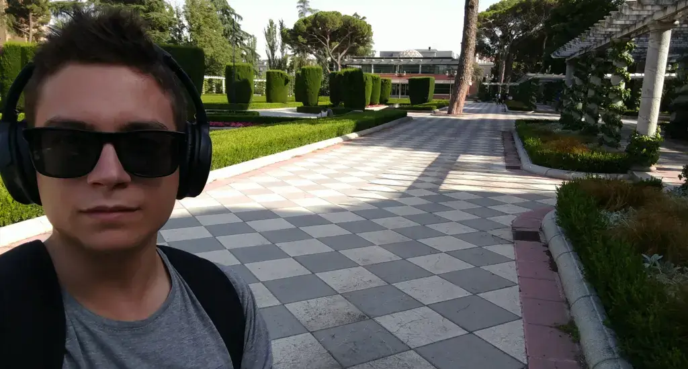

# Dani Guardiola

Software engineer and student of a double bachelor's degree in math and physics.

## > I blog at [dio.la](https://dio.la)

Thanks for visiting my profile! Some quick facts about me:

- **Design system developer** and AI tamer (among other things) at [create](https://create.xyz/).
- **Math and physics student** at UGR (University of Granada, Spain).
- Very into **music**, although I don't have much time to practice or study these days!
- Born and based in **Spain**. I love traveling and work remotely from different locations.
- Always having **fun**, always **learning**, always **building**.
- Advocate for **free and open source software and hardware**, **right to repair**, and **privacy**.
- **Kindness** over profit. **Collaboration** over competition. **Building for humans** over building for money.

Find me on [Twitter](https://twitter.com/daniguardio_la) or email me at [hi@daniguardio.la](mailto:hi@daniguardio.la).

Also check my blog out at [dio.la](https://dio.la)! I try ~~and fail~~ to keep it updated with my latest projects and thoughts.
